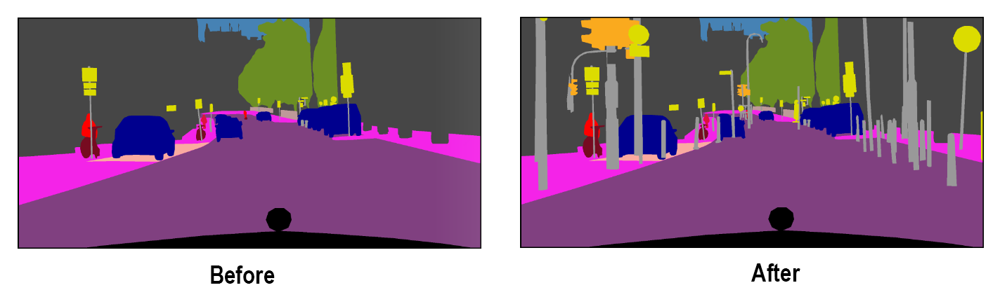

# cityscapes-object-augmenter
This script is one step in a pipeline for object level data augmentation for cityscapes. It searches at semantic level for suitable objects to place in a certain semantic image map. It prioratizes objects from images with similar depth maps to place objects more realistically. 

Prerequisites:
- Cityscapes gtFine_trainvaltest.zip
- Cityscapes disparity_trainvaltest.zip

Example:

